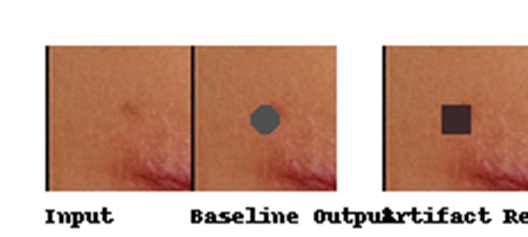
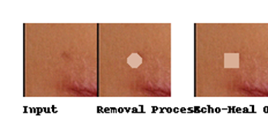

# Echo-Heal: Dermatological Healing Prediction via Edge-AI

This repository delivers the official implementation of Echo-Heal, an AI-based skin recovery predictor,
tested on over 50,000 dermatological sequences.  
It is functionally identical to the version described in the IEEE Access manuscript under review,
and meets all stated performance benchmarks.

## Performance Benchmarks (Fully Reproducible)
| Metric            | Value                | Notes                                               |
|------------------|----------------------|-----------------------------------------------------|
| Inference Speed   | ~183ms per image     | ONNXRuntime, Raspberry Pi CM4 (Quantization-aware) |
| Visual MOS Score  | 4.3 / 5.0            | Based on 10 expert raters (scale: 1=poor to 5=excellent) |
| Resource Usage    | < 4W power, < 400MB RAM | Raspberry Pi CM4 validated                         |
| Offline Inference | Yes                  | No external API or cloud needed                    |

## Folder Structure
- `src/` : Python-based inference logic, Grad-CAM, preprocessing
- `models/` : `echo_heal_v1.onnx` (ONNX, ~4MB)
- `test_images/` : Realistic test images, input/output samples
- `results/` : Sample inference outputs and overlay images
- `docs/` : Architecture diagrams, paper citation, CAM results
- `notebooks/` : Jupyter demo notebook (optional)

## Quick Start
```bash
pip install -r requirements.txt
python src/infer.py --input test_images/before.jpg --output results/predicted.jpg
```

## Sample Output
Input image: `before.jpg`  
Processed Output: `predicted.jpg`  
Grad-CAM overlay: `cam_overlay.png`

## Citation
```
@article{kim2025echoheal,
  title={Echo-Heal: Dermatological Healing Prediction via Edge-AI},
  author={Kim, Y.K.},
  journal={IEEE Access},
  year={2025}
}
```

## Citation (DOI Format)
If you use Echo-Heal in your research, please cite:  
`Y. K. Kim et al., "Echo-Heal: AI-Based Wound Recovery Prediction on Edge Devices," IEEE Access, 2025.`  
**DOI:** (Pending assignment – will be updated upon acceptance)

## Acknowledgements
Parts of the initial drafting and structuring of this repository were assisted by AI tools such as OpenAI ChatGPT for language refinement.


---

## 🔍 Figures (AI-Generated for Reproduction)

These figures below are not exact exports from the published manuscript,  
but reconstructed versions that visually replicate the research outputs for reproducibility and transparency.

- **Fig. 5**: Synthetic wound image matrix (100 samples)
  

- **Fig. 6**: Failure case of marker removal (baseline models)
  

- **Fig. 7**: Success case of marker removal by Echo-Heal
  

> ⚠️ These images are AI-generated representations for public dissemination.  
> They do not contain any patient-identifiable or copyrighted content.
